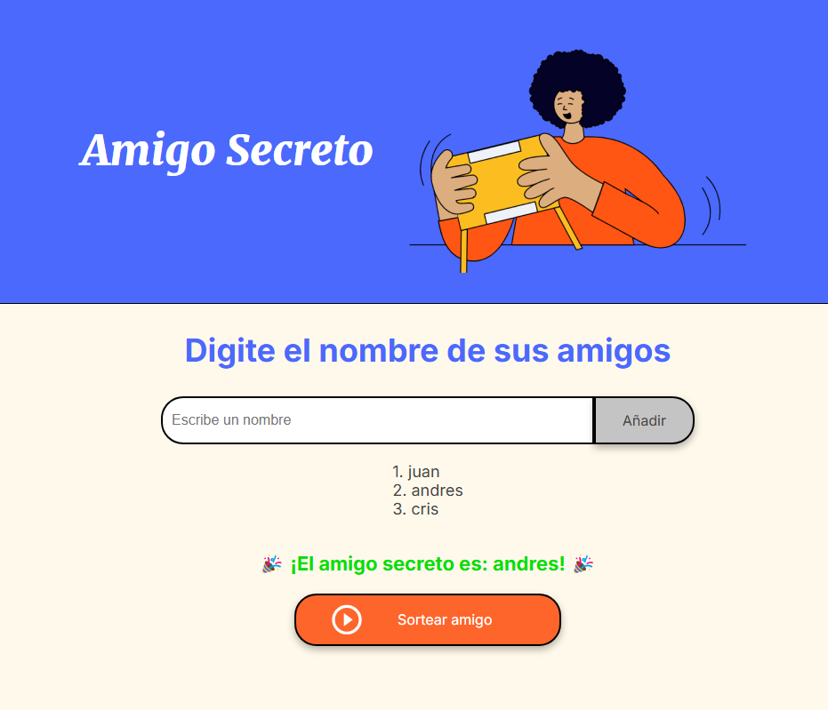

# Amigo Secreto

## Descripción

**Amigo Secreto** es una aplicación web simple que permite a los usuarios agregar nombres de amigos a una lista y realizar un sorteo aleatorio para determinar quién será el "amigo secreto". Es ideal para eventos festivos, reuniones de trabajo o cualquier ocasión en la que se quiera organizar un intercambio de regalos.

## Funcionalidades

- **Agregar Nombres:** Los usuarios pueden ingresar el nombre de sus amigos en un campo de texto y agregarlo a una lista visible.
- **Validación de Entrada:** Si el campo de texto está vacío, la aplicación mostrará una alerta solicitando un nombre válido.
- **Visualización de la Lista:** Los nombres agregados se muestran en una lista debajo del campo de entrada.
- **Sorteo Aleatorio:** Al hacer clic en el botón "Sortear Amigo", se selecciona aleatoriamente un nombre de la lista y se muestra en pantalla.

## Tecnologías Utilizadas

- **HTML5:** Estructura de la aplicación.
- **CSS3:** Estilización de la interfaz.
- **JavaScript:** Lógica para agregar amigos y realizar el sorteo.

## Instalación

1. Clona este repositorio:
   ```bash
   git clone https://github.com/ImCrisam/-logica-programacion-challenge-amigo-secreto
   ```
2. Abre el archivo `index.html` en tu navegador preferido:
   ```bash
   open index.html
   ```

## Uso

1. Ingresa el nombre de un amigo en el campo de texto.
2. Haz clic en "Añadir" para agregar el nombre a la lista.
3. Repite el proceso para agregar más amigos.
4. Haz clic en "Sortear Amigo" para seleccionar un amigo secreto al azar.



## Licencia

Este proyecto está bajo la licencia [MIT](LICENSE).

---

**Desarrollado por:** [Tu Nombre o Enlace a tu Perfil]
